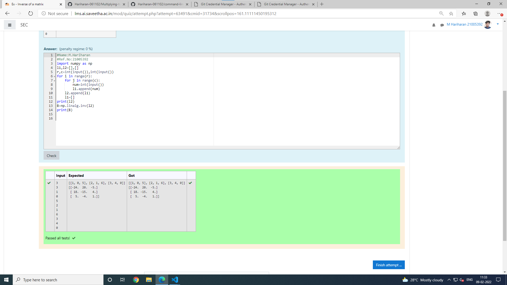

# Inverse-of-matrix

## AIM:

## ALGORITHM:
### Step 1:
### Step 2:
### Step 3:
### Step 4:
### Step 5:

## PROGRAM:
~~~
#Name:M.Hariharan
#Ref.No:21005392
import numpy as np
l1,l2=[],[]
r,c=int(input()),int(input())
for i in range(r):
    for j in range(c):
        num=int(input())
        l1.append(num)
    l2.append(l1)
    l1=[]
print(l2)
B=np.linalg.inv(l2)
print(B)

~~~

## OUTPUT:

## RESULT:
